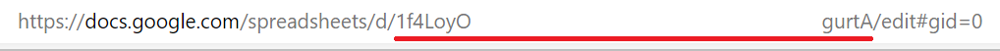

# Tracardi plugin

This code can be run within Tracardi workflow.

# Google Sheets Integrator Action

The purpose of this plugin is to connect with Google Sheets: you can get data or 
parse data to this via your service account.

# Configuration

This node requires configuration. 

You need to know a path to your service account's key. You can download it
 after creating service account. To create service account go to your project's dashboard on
Google Cloud Platform -> API & Services -> Credentials ->
manage service accounts -> create service accounts. After that, you should create key
to your service account - on the list of your keys, click on three dots -> Manage keys
-> add key, choose JSON, then the key file will be downloaded. Move the file to your
desired location, copy the path to the file with the filename and paste it to service_account_key.

You also need to know your spreadsheet id. You can read this from url of your spreadsheet. Here is 
an example:



After that, you should know your sheet name and range to read data from or to write data in.

The next step is to set if you can read data or parse data. You can do only one operation at the same
time. 

Moreover, if you want to write data, you need to set values you want to
parse. The values format looks like some brackets (as many as the number of 
columns of data you want to write) where there are some values (as many as the number od 
rows) separated by commas. 


Example #1 - get data:

```json
init = {
        "service_account_key": "path/to/your/service_account_key.json",
        "spreadsheet_id": "your_spreadsheet_id",
        "sheet": "Sheet1",
        "range": "A2:C4",
        "read": True,
        "write": False,
        "values": None,
    }
```

Example #2 - parsing data:

```json
"init"={
        "service_account_key": "path/to/your/service_account_key.json",
        "spreadsheet_id": "your_spreadsheet_id",
        "sheet": "Sheet1",
        "range": "A2:C4",
        "read": False,
        "write": True,
        "values": [['some', 'of'], ['your', 'data']],
    }
```

# Input payload

This node does not process input payload.

# Output

This node return output to client: 
* if the client got data, it returns sheet and range, 
major dimensions and values.
 git init* if the client got data, it returns spreadsheet id, sheet and range, 
 number of updated rows, columns and cells